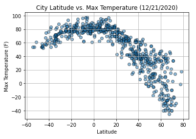
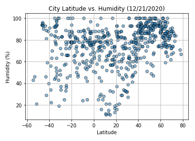
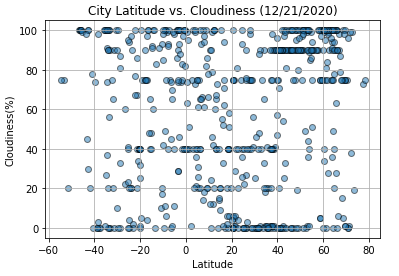
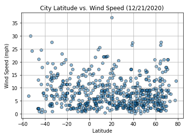
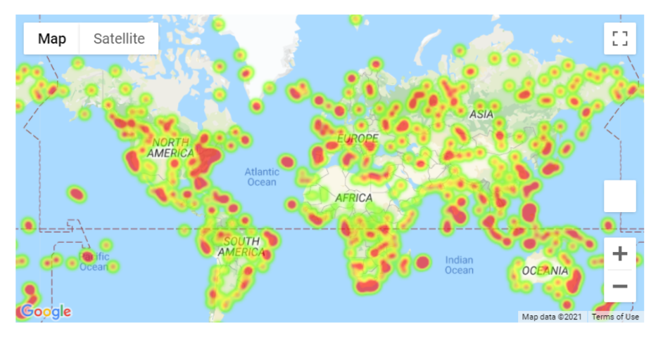
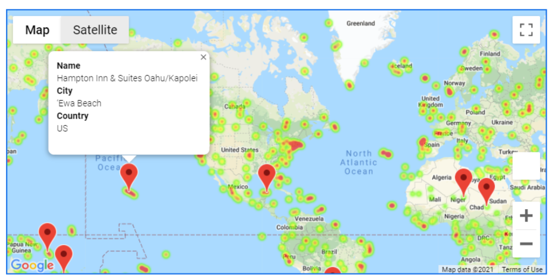

# python-api-challenge

### Overview
Use Python requests, APIs, and JSON traversals to answer a fundamental question: "What's the weather like as we approach the equator?
 
## Part I - WeatherPy 
 
In this instance, create a Python script to visualize the weather of 500+ cities across the world of varying distance from the equator. To accomplish this, you'll be utilizing a simple Python library, the OpenWeatherMap API, and a little common sense to create a representative model of weather across world cities.
The first requirement is to create a series of scatter plots to showcase the following relationships:

**Max Temperature (F) vs. Latitude**

**Humidity (%) vs. Latitude**

**Cloudiness (%) vs. Latitude**

**Wind Speed (mph) vs. Latitude**

 
 
The second requirement is to run linear regression on each relationship. This time, separate the plots into Northern Hemisphere (greater than or equal to 0 degrees latitude) and Southern Hemisphere (less than 0 degrees latitude):

* Northern Hemisphere - Temperature (F) vs. Latitude
* Southern Hemisphere - Temperature (F) vs. Latitude
* Northern Hemisphere - Humidity (%) vs. Latitude
* Southern Hemisphere - Humidity (%) vs. Latitude
* Northern Hemisphere - Cloudiness (%) vs. Latitude
* Southern Hemisphere - Cloudiness (%) vs. Latitude
* Northern Hemisphere - Wind Speed (mph) vs. Latitude
* Southern Hemisphere - Wind Speed (mph) vs. Latitude

Final has randomly select at least 500 unique (non-repeat) cities based on latitude and longitude. Performs a weather check on each of the cities using a series of successive API calls. Includes a print log of each city as it's being processed with the city number and city name. Saved a CSV of all retrieved data and a PNG image for each scatter plot.

### Observations
  * One finds higher temperature at latitudes closer to the equator (0) and cooler temperatures as you increase north or south.
  * Cloudiness, Wind Speed and Humidity have weak correlation to latitude and do not appear to be effected by nearing the equator.
  * Of the weak correlations, wind speed had the lowest r values, in specific the norther hemisphere at r = 0.002
  
  
## Part II - VacationPy 

Create a heat map that displays the humidity for every city from Part I.

Narrow down the DataFrame to find your ideal weather condition. 
  * A max temperature lower than 80 degrees but higher than 70.
  * Wind speed less than 10 mph.
  * Max cloudiness less than 10%.
 

Use Google Places API to find the first hotel for each city located within 5000 meters of your coordinates.
Plot the hotels on top of the humidity heatmap with each pin containing the Hotel Name, City, and Country.

## Considerations

  * The city data is generated from random coordinates (longitude and latitude). This means that the outputs will not be an exact match each time the code is run and not all cities will be encluded in all searches
